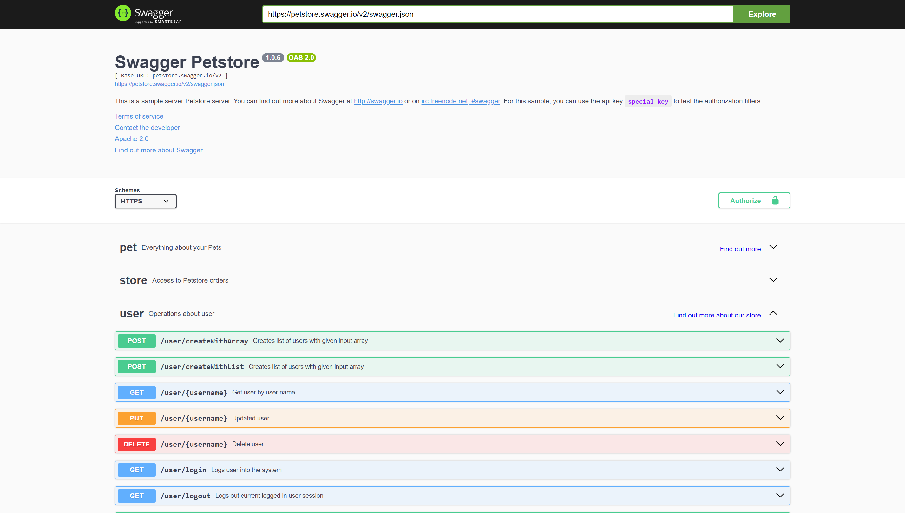
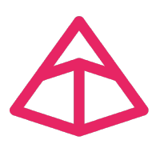
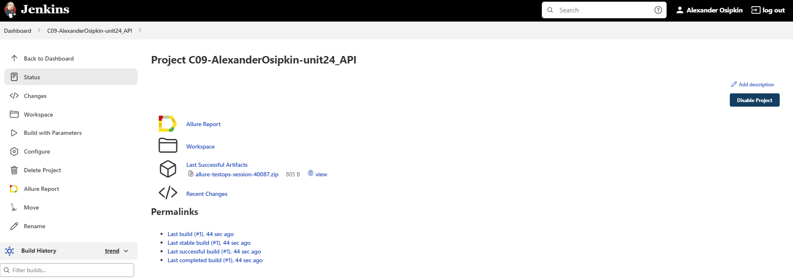
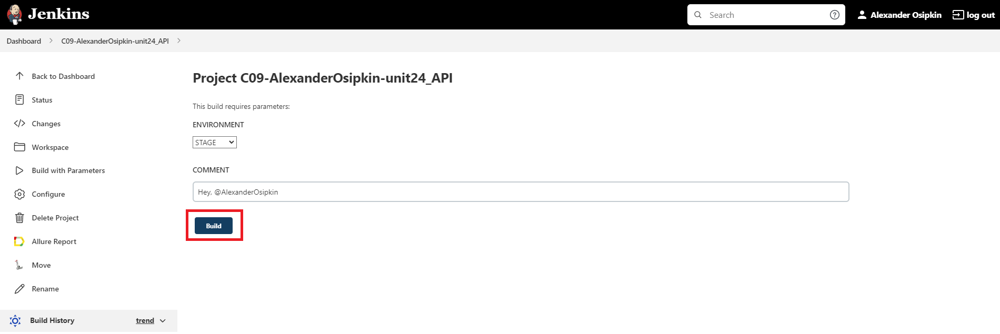
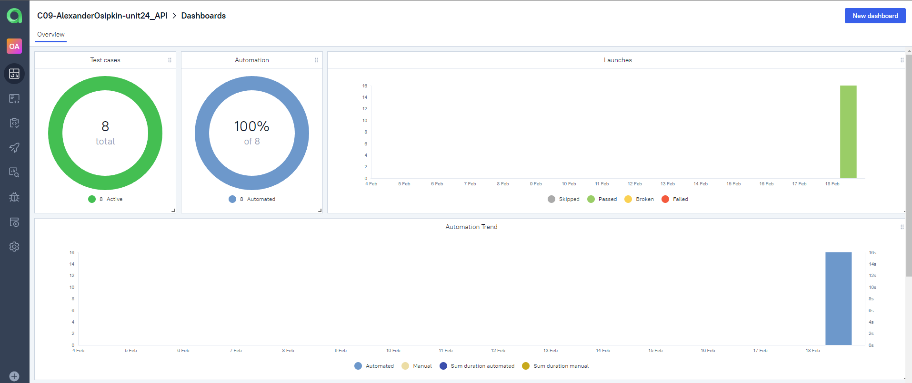
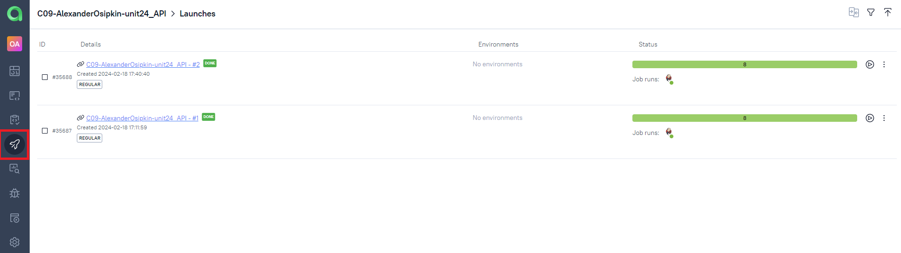
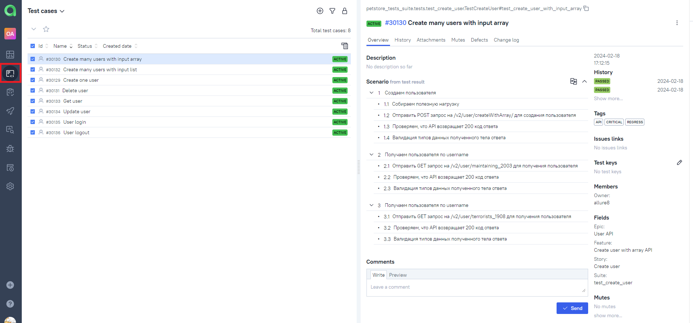
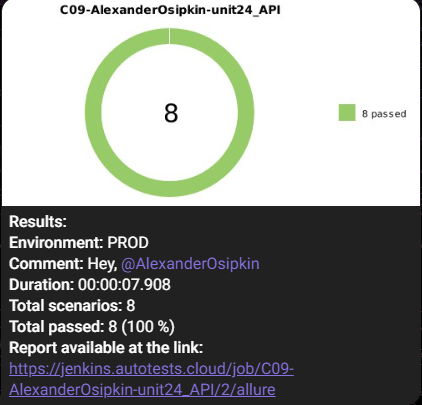

# Проект по автоматизации тестирования API Petstore
> <a target="_blank" href="https://petstore.swagger.io/">petstore.swagger.io</a>



----

### Особенности проекта

* Оповещения о тестовых прогонах в Telegram
* Отчеты с request body, response body, status code
* В тестах проверяются request body, response body, status code
* В тестах присутствует валидация типов данных, как request body, так и response body
* Валидация Pydantic
* Сборка проекта в Jenkins
* Отчеты Allure Report
* Интеграция с Allure TestOps
* Автоматизация отчетности о тестовых прогонах и тест-кейсах в Jira
* Генерация тестовых данных Mimesis

### Список проверок

- [x] Создать одного пользователя
- [x] Создать нескольких пользователей при помощи массива
- [x] Создать нескольких пользователей при помощи листа
- [x] Удалить пользователя
- [x] Получить пользователя по username
- [x] Обновить пользователя
- [x] Авторизоваться
- [x] Выйти из системы

----

### Используемый стэк

          

----

### Запуск автотестов в Jenkins

1. Открыть <a target="_blank" href="https://jenkins.autotests.cloud/job/C09-AlexanderOsipkin-unit24_API/">проект</a>


2. Нажать "Build with Parameters"
3. Выбрать окружение и в поле "COMMENT" ввести комментарий
4. Нажать "Build"



----

### Локальный запуск автотестов

1. Клонируйте репозиторий
```ruby
gh repo clone AlexanderOsipkin/qa_guru_python_9_24_API
```
2. Создайте и активируйте виртуальное окружение
  ```ruby
  python -m venv .venv
  source .venv/bin/activate
  ```
3. Установите зависимости с помощью pip
  ```ruby
  pip install -r requirements.txt
  ```
4. Запустите автотесты 
  ```ruby
  pytest -sv
  ```
5. Получите отчёт allure
```ruby
allure serve allure-results
``` 

----

### Интеграция с Allure TestOps
#### <a target="_blank" href="https://allure.autotests.cloud/project/4048/dashboards">Ссылка на проект</a>



#### <a target="_blank" href="https://allure.autotests.cloud/project/4048/launches">История запуска тестовых наборов</a>



#### <a target="_blank" href="https://allure.autotests.cloud/project/4048/test-cases/30130?treeId=0">Тест кейсы</a>



----

### Оповещение в Telegram

